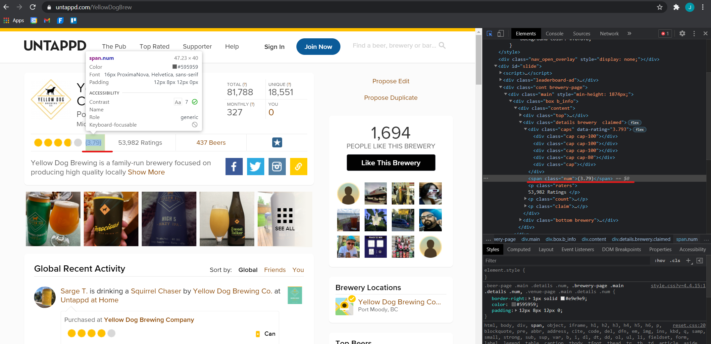

```{r setup, include=FALSE}
knitr::opts_chunk$set(echo = TRUE)
```

# Webscraping Brewery Data using R

For the purpose of this document, we will be webscraping the brewery ratings 
for Montreal breweries on [Untappd](https://untappd.com/). 

Why Montreal breweries? This was an idea I had for a research paper in 2018 
but fell through because of the lack of variance in the data.

Lets begin by reading in a csv of all the Breweries in Montreal. 

```{r, warnings=FALSE, messages=FALSE}
library(dplyr)
library(stringr)
library(rvest)
library(purrr)

df <- read.csv('Quebec_Brewery_Data.csv')
names(df)
```

There is a lot of good data here, including the latitude and longitude of each 
brewery, and most importantly the URL to each brewery's Untappd page. 

Lets do some quick cleaning: 

```{r, warnings=FALSE, messages=FALSE}
df <- rename(df, Brewery = `ï..Name..Social.Reason.`)

cols <- c('Brewery', 
          'City',
          'Untappd',
          'Latitude',
          'Longitude')

df <- df[cols]
```


Lets grab the Untappd score for each brewery.  
Here is an example of how we would grab the score on one brewery.

We want to go to inspect an Untappd page and look for the html tags associated 
with the data we wish to scrape. 



```{r, warnings=FALSE, messages=FALSE}
# Where do we want to get the data
url = 'https://untappd.com/' 
ext = 'YellowDogBrew'

page = read_html(paste0(url,ext))

# use the html tags to find the data of interest
page %>%
  html_nodes(".num") %>%
  html_text() %>%
  str_replace(pattern = '\\(', "") %>%
  str_replace(pattern = '\\)', "")
```

With this general approach, we are able to loop through the entire list 
of URLs, grabbing their brewery scores. 

** Note, it is important to add a sleep timer when scraping **

```{r}
# run on a sample of URLs
dt <- df[1:10, ]
```

```{r, warnings=FALSE, messages=FALSE}
brewery_score <- function(url){
  sleep <- runif(1, min = 1.5, max = 3)
  Sys.sleep(sleep) # rest period between scrapes
  url = as.character(url)
  page <- read_html(url)
  y <- page %>%
    html_nodes(".num") %>%
    html_text() %>%
    str_replace(pattern = '\\(', "") %>%
    str_replace(pattern = '\\)', "")
  print(url)
  return(y)
}

results <- map_chr(dt$Untappd, brewery_score)
results <- as.numeric(results)

dt <- cbind(dt, results)
```


For brevity, I will load in the results from scraping each URL. 


## Fun visualizations
We can use the latitude longitude to compare the quality of breweries in Montreal.  


Improvements: 
1. We can add a TryCatch to the URL scrape to aoid breaking with broken URLs. 
