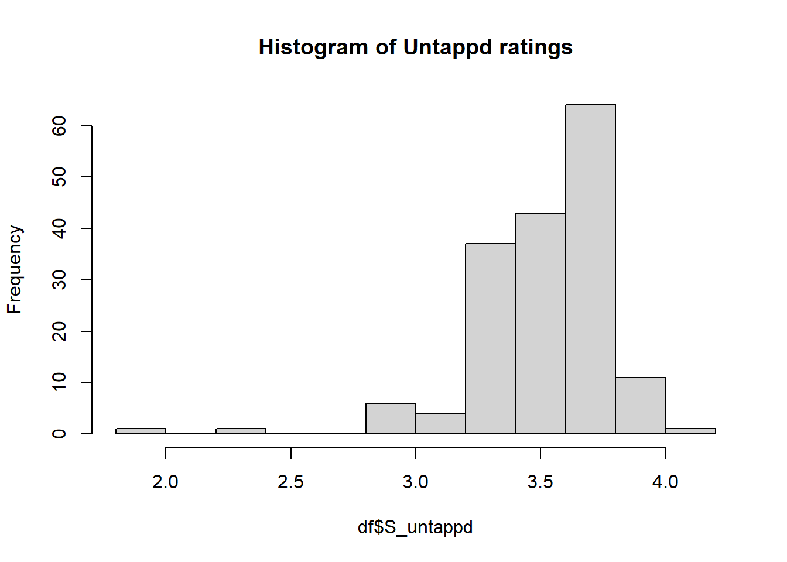
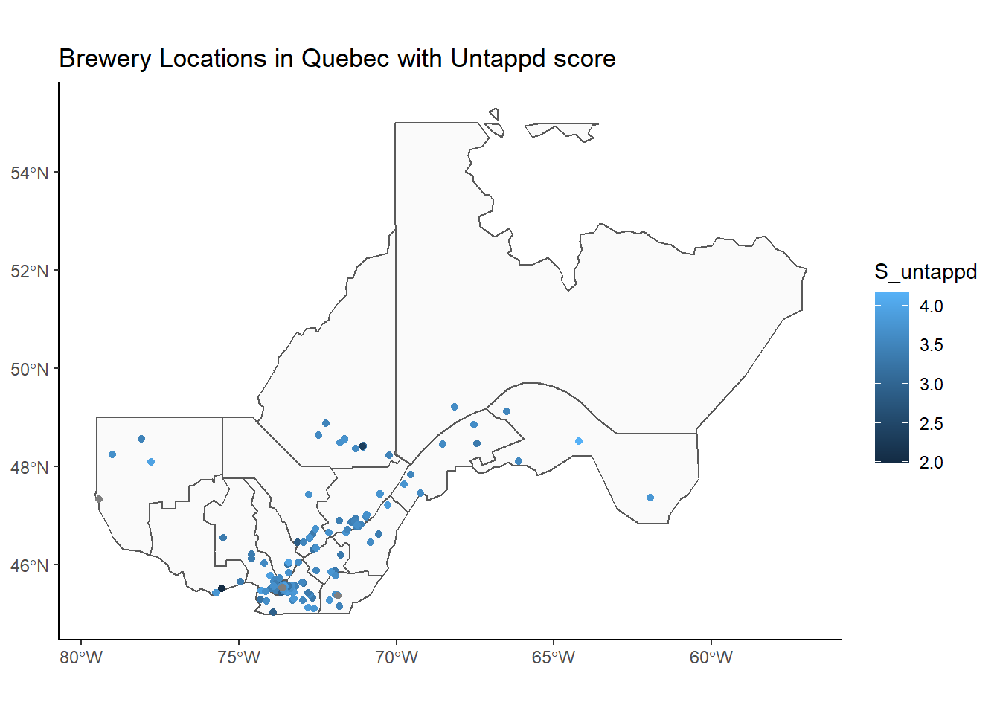
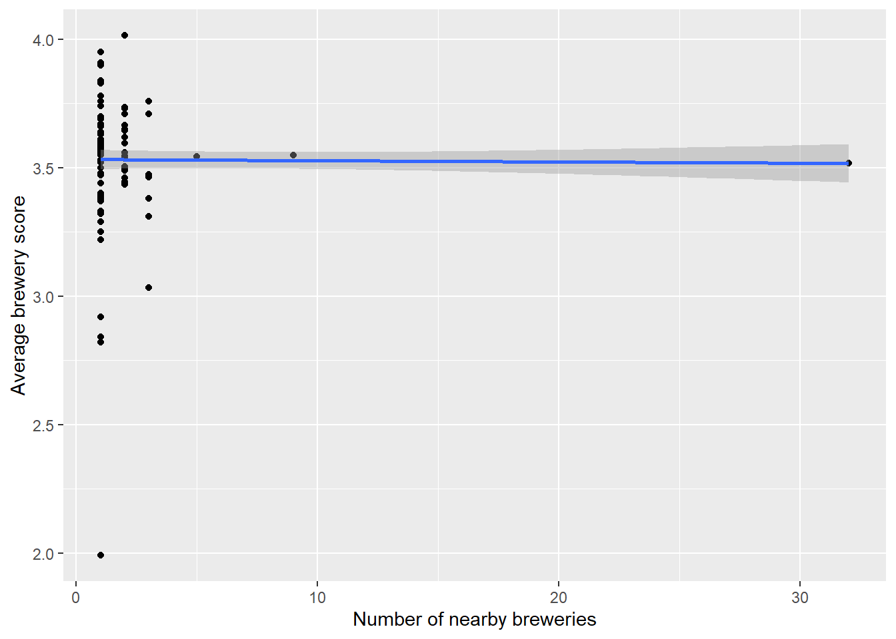
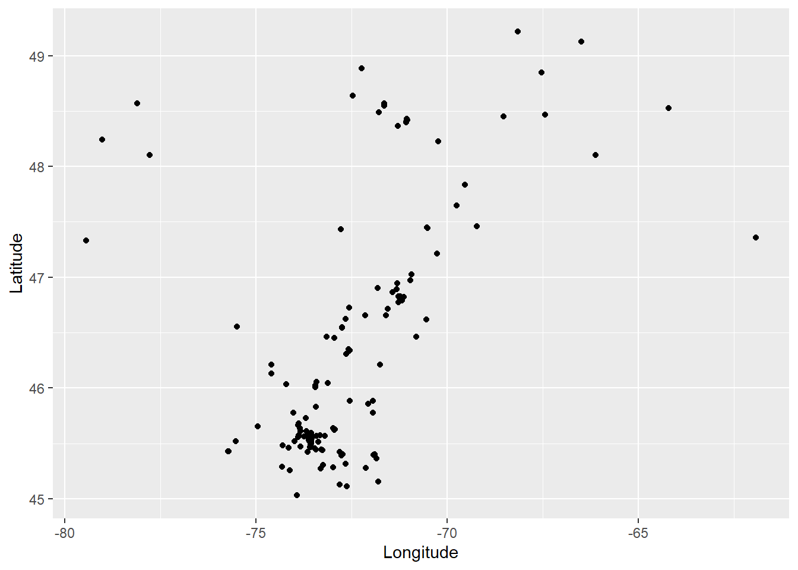
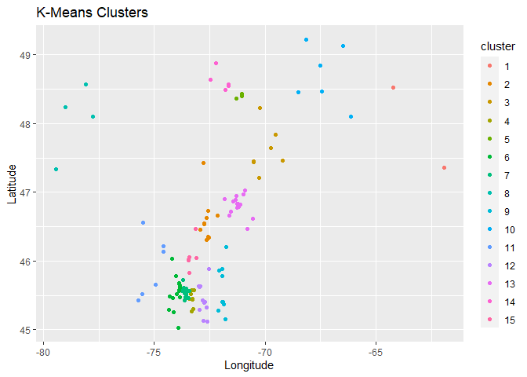
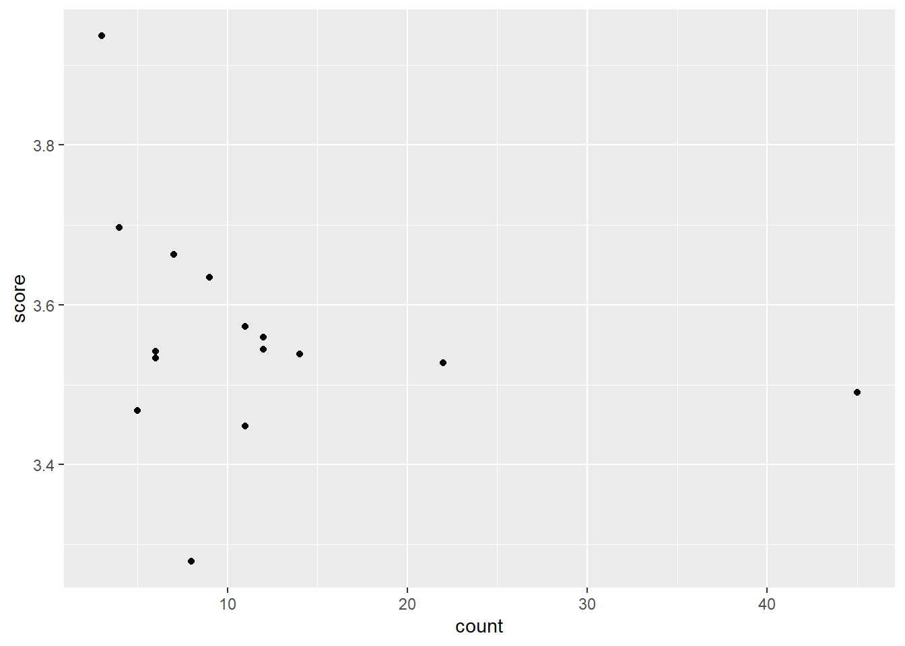

Webscraping Brewery Data using R
================
Jordan Hutchings
25/05/2021

For the purpose of this document, we will be webscraping the brewery
ratings for Montreal breweries on [Untappd](https://untappd.com/).

Why Montreal breweries? This was an idea I had for a research paper in
2018 but fell through because of the lack of variance in the data.

Lets begin by reading in a csv of all the Breweries in Montreal.

``` r
library(dplyr)
library(stringr)
library(rvest)
library(purrr)
library(kableExtra)

df <- read.csv('Quebec_Brewery_Data.csv')
names(df)
```

    ##  [1] "ï..Name..Social.Reason."    "Legal.Designation"         
    ##  [3] "Other.Designation"          "Address"                   
    ##  [5] "City"                       "Postal.Code"               
    ##  [7] "Province"                   "Country"                   
    ##  [9] "Latitude"                   "Longitude"                 
    ## [11] "Administration.Region"      "Permit.."                  
    ## [13] "Measure.under.the.Permit.." "Type.of.Permit"            
    ## [15] "AMBQ.Member"                "Year.Founded"              
    ## [17] "Website"                    "Email"                     
    ## [19] "Telephone"                  "Facebook"                  
    ## [21] "Ratebeer"                   "Untappd"                   
    ## [23] "Menu"                       "Twitter"                   
    ## [25] "Wikidata"                   "Youtube"                   
    ## [27] "Instagram"                  "Pinterest"                 
    ## [29] "Snapchat"                   "Other"                     
    ## [31] "Notes"

There is a lot of good data here, including the latitude and longitude
of each brewery, and most importantly the URL to each brewery’s Untappd
page.

Lets do some quick cleaning:

``` r
df <- rename(df, Brewery = `ï..Name..Social.Reason.`)

cols <- c('Brewery', 
          'City',
          'Untappd',
          'Latitude',
          'Longitude')

df <- df[cols]
```

Lets grab the Untappd score for each brewery.  
Here is an example of how we would grab the score on one brewery.

We want to go to inspect an Untappd page and look for the html tags
associated with the data we wish to scrape.

We use the `rvest` library. This works well to download the webpage HTML
and collect the data points based on the CSS tags.


## Example scrape

``` r
# Where do we want to get the data
url = 'https://untappd.com/' 
ext = 'YellowDogBrew'

page = read_html(paste0(url,ext))

# use the html tags to find the data of interest
page %>%
  html_nodes(".num") %>%
  html_text() %>%
  str_replace(pattern = '\\(', "") %>%
  str_replace(pattern = '\\)', "")
```

    ## [1] "3.79"

With this general approach, we are able to loop through the entire list
of URLs, grabbing their brewery scores.

*Note, it is important to add a sleep timer when scraping*

``` r
# run on a sample of URLs
dt <- df[1:2, ]
```

## Write a function to loop through all the URLs

``` r
brewery_score <- function(url){
  sleep <- runif(1, min = 1.5, max = 3)
  Sys.sleep(sleep) # rest period between scrapes
  url = as.character(url)
  page <- read_html(url)
  y <- page %>%
    html_nodes(".num") %>%
    html_text() %>%
    str_replace(pattern = '\\(', "") %>%
    str_replace(pattern = '\\)', "")
  print(url)
  return(y)
}

results <- map_chr(dt$Untappd, brewery_score)
```

    ## [1] "https://untappd.com/LeChevalBlancCo"
    ## [1] "https://untappd.com/w/l-inox-ma-tres-brasseurs/17654"

``` r
results <- as.numeric(results)

dt <- cbind(dt, results)
```

For brevity, I will load in the results from scraping each URL.

``` r
df <- read.csv('untapped_Scrape.csv')
```

We can see the distribution of Untappd scores.

``` r
hist(df$S_untappd, main = 'Histogram of Untappd ratings')
```

<!-- -->

# Fun visualizations

We can use the latitude longitude to compare the quality of breweries in
Montreal.

``` r
library(sf)
library(ggplot2)

poly <- "MN.geojson"
shps <- st_read(poly)
pnts <- data.frame(x=df$Longitude,y=df$Latitude)
my_sf <- st_as_sf(df, coords = c('Longitude', 'Latitude'), crs = st_crs(shps) )
pnts_sf <- st_as_sf(pnts, coords = c('x', 'y'), crs = st_crs(shps))

# keep only regions of Quebec with breweries
in_poly <- st_join(pnts_sf, shps, join = st_within)
df$geometry <- paste(df$Longitude, df$Latitude, sep=", ")
pnts_sf <- st_join(pnts_sf, my_sf, by = 'geometry')
regions <- subset(shps, res_nm_reg %in% unique(in_poly$res_nm_reg))
```

``` r
ggplot() + 
  geom_sf(data = regions, alpha = 0.2) +
  geom_sf(data = my_sf, aes(col = S_untappd)) +
  theme_classic() + 
  ggtitle("Brewery Locations in Quebec with Untappd score")
```

<!-- -->

# Do breweries close to eachother outpreform the average brewery?

We can group breweries by those sharing latitude and logitude
coordinates.  
Then we can run a regression to see if those near eachother have higher
ratings.

``` r
df$lat <- round(df$Latitude, 1)
df$lng <- round(df$Longitude, 1)
df$latlng <- paste(df$lat, df$lng)

avg_scores <- df %>%
  group_by(latlng) %>%
  summarise(n = n(), 
            avg = mean(S_untappd, na.rm=T)
            ) %>% arrange(desc(n))

df <- merge(df, avg_scores, by = 'latlng')

ggplot(df, aes(x=n, y=avg)) + 
  geom_point() + 
  geom_smooth(method = lm) + 
  labs(x = 'Number of nearby breweries', 
       y = 'Average brewery score' 
       )
```

<!-- -->

As we can see, there is no impact from this method. Could also look at
distance, or clusters of breweries.

## Clustering

Here is a plot of the latitude and longitudes of each brewery.

``` r
ggplot(df, aes(x=Longitude, y=Latitude)) + geom_point()
```

<!-- -->

``` r
coord <- select(df, Longitude, Latitude)
clusters <- kmeans(coord, 15)
df$cluster <- as.factor(clusters$cluster)

ggplot(df, aes(x=Longitude, y=Latitude)) + 
  geom_point(aes(color = cluster)) + 
  labs(title = 'K-Means Clusters')
```

<!-- -->

``` r
df %>%
  group_by(cluster) %>%
  summarise(score = mean(S_untappd, na.rm=T), count = n()) %>%
  ungroup() %>%
  ggplot(aes(x = count, y = score)) + geom_point()
```

<!-- -->

``` r
tbl <- df %>%
  mutate(Num_in_cluster = ifelse(n > 20, '20+', '<20')) %>%
  group_by(Num_in_cluster) %>%
  summarise(score = mean(S_untappd, na.rm=T))

kbl(tbl)
```

<table>

<thead>

<tr>

<th style="text-align:left;">

Num\_in\_cluster

</th>

<th style="text-align:right;">

score

</th>

</tr>

</thead>

<tbody>

<tr>

<td style="text-align:left;">

\<20

</td>

<td style="text-align:right;">

3.531986

</td>

</tr>

<tr>

<td style="text-align:left;">

20+

</td>

<td style="text-align:right;">

3.516667

</td>

</tr>

</tbody>

</table>

And.. still no luck. Good thing I dropped this idea.
